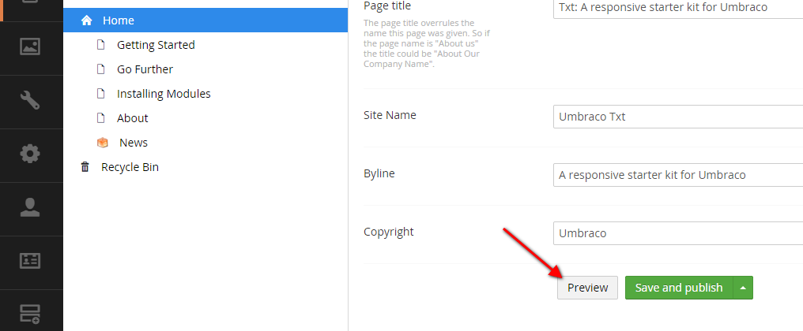
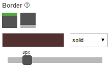
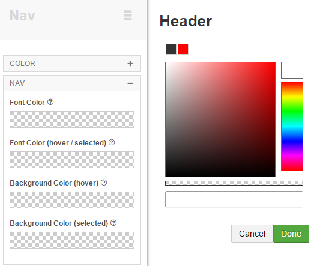
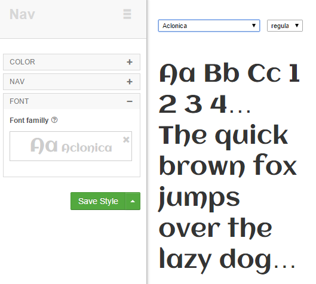
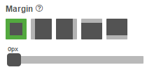
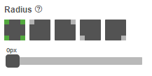
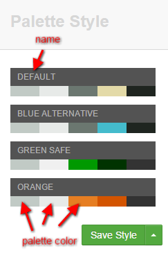
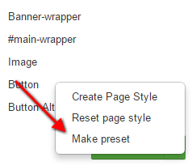
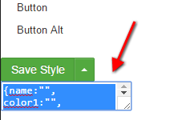

#Canvas designer
 
##What is the Canvas Designer?

The Canvas Designer is an Umbraco feature that lets you edit styles in real time.

You can accurately change CSS properties using just your mouse, without a single line of code. Any changes are immediately displayed, which is perfect for making templates. The Canvas Designer has a set of style editors to change properties like colors, sizes and borders, as well as others. You can see a list of all available editors in the [Editors section](#editors).


##Getting Started

###Enable the Canvas Designer

To enable the Canvas Designer for your website, all you have to do is add one statement inside the `head` tag of your site's main template:

```csharp
@Umbraco.EnableCanvasDesigner()
```

Place this statement just after the stylesheet links.
	


###Using the Canvas Designer

To use the Canvas Designer, first select any page in the Umbraco backoffice and click on its "Preview" button.




Once the preview has loaded, you will find the Canvas Designer options on the left-hand side panel, just below the device preview buttons. There are two options: Palette and UI Designer.


The first option, Palette, consists of a set of pre-configured styles that can be directly applied to the website. Any change is immediately displayed on the page's preview, on the right-hand side panel. 


The second option, UI Designer, allows you to edit the page's styles element by element.


The flyout panel shows you the list of elements that can be edited. 
You can either click on an element on the list, or you can click anywhere on the preview pane and its element will be selected.


Once you have selected an element, you can modify its styles with the different style editors that are available.


Once you have finished editing an element's style you can click on the burger menu at the top right corner of the second panel. This takes you back to the main element list.


###Save the page's style

Save the custom styles you have defined by clicking on the Save Styles button. This will compile and minify all these styles into a ready to use .css file. The `@Umbraco.EnableCanvasDesigner()` statement mentioned before will automatically add a stylesheet link to this file into the webpage.


###Create page styles

By default, custom styles are applied to the entire web site, from its root node to all its descendants. If you need a node to have a different style, however, you can create a new Page Style that will be applied to that node and all its descendants. While previewing the target page, click on the little upwards-pointing arrow next to the Save Style button and then click on Create Page Style. From now on, this node and its descendants will have a separate set of styles applied. Any changes in the parent styling will not affect the custom Page Style, as a new CSS file is generated for this node and its descendants, and is applied instead of the parent CSS file.


###Reset Style

You can reset the custom styling for a node and its descendants. Click on the upwards-pointing arrow next to Save Style and click on Reset page style. This deletes the custom CSS file and applies the parent CSS file to the node and its descendants.


##Configuration

###Canvas Designer Configurations

By default, the Canvas Designer comes with a simple configuration for the Umbraco Starter Kit styles edition. However, custom configuration can be easy done for any kind of mark-up and designs.

The Canvas designer is configured via a JSON file. You can specify the path to a configuration file to the `EnableCanvasDesigner` method as its first argument.


The configuration defines a set of elements and the style editors that can be used on each of those elements.

```js
var canvasdesignerConfig = {
	configs: [
		{
			name: "Body",
			schema: "body",
			selector: "body",
			editors: [
				{
					type: "background",
					category: "Color",
					name: "Background",
				},
				.
				.
				.
			]
		}
	]
}
```
	
The configs object is an array of objects that each have 4 properties:

- name: (mandatory) the element's friendly name (Body/Header/Main Column/...).
- schema: (mandatory) collection of [jQuery selectors](http://api.jquery.com/category/selectors/) that specify which DOM elements the custom styles will be applied to by default (body/h1/.main/p, a, span/...).
- selector: (optional) single jQuery selector used to highlight the associated high-level element in the preview pane (body/h1/.header/...). If empty, `schema` is used instead.
- editors: (mandatory) array of style editors available for the element. Each editor can override which DOM elements it applies its style to by specifying its own `schema` property.

The `selector` and `schema` properties are similar, but it is important to understand the difference. The `selector` property exists to make life easier for the end user. The `schema` property exists to actually apply a style.

Imagine a navigation menu marked up as a <nav> element with its menu items in a nested `<ul>` element. In preview mode, the user will click somewhere on the navigation menu and expect to see style editors for all of its components: the menu itself, the menu items, the logo, etc. For this to work, the selector would have to be set to `"nav"`. While the whole menu should be highlighted in the preview pane, each style editor needs a specific selector to correctly apply its styles.

For example, there could be two style editors. One would change the whole menu's background color and the other would change each menu item's background color. To avoid the menu item style editor from changing the whole navigation menu's background it would need a narrower schema. Setting this second editor's schema to `"nav ul li"` would fix the problem.

#### Editors

The Canvas Designer comes with 9 different available editors:

- background
- border
- color
- googlefontpicker
- margin
- padding
- radius
- shadow
- slider

The base parameters of these editor are:

	{
		type: "...",     // mandatory, alias of the editor (background, border...)
		category: "...", // mandatory, string that describe the category of the editor (color, position...)
		name: "..."      // mandatory, friendly name of the editor (Background, Background color ...)
		schema: "..."	 // optional, overwrite the schema parameter of the config
		...
	}
	
Furthermore, some editors have others additional parameters.

##### Background editor

*Alias*: background

This editor is used for editing the color and the image background.
Images are picked up from the Umbraco Media library

It doesn't have any additional parameter.
 

 
##### Border editor

*Alias*: border

This editor is used for editing element borders.

*Parameters*:

	{
		...
		enable: ["top", "bottom"...] 	// optional, which edge can be editable: "all", "left", "right", "top", "bottom"
	}
	


##### Color editor

*Alias*: color

This editor is used for editing color (font, border, background...).

*Parameters*:

	{
		...
		css: "..."	// mandatory, css tag use to apply the color (color, border-color, background-color ...) 
	}


	
##### Googlefontpicker editor

*Alias*: googlefontpicker

This editor is used for editing web and googlefont family.

It doesn't have any additional parameter.



##### Margin editor

*Alias*: margin

This editor is used for editing element margins.

*Parameters*:

	{
		...
		enable: ["top", "bottom"...] 	// optional, which edge can be editable: "all", "left", "right", "top", "bottom"
	}
	

	
##### Padding editor

*Alias*: padding

This editor is used for editing element paddings.

*Parameters*:

	{
		...
		enable: ["top", "bottom"...] 	// optional, which edge can be editable: "all", "left", "right", "top", "bottom"
	}


	
##### Radius editor

*Alias*: radius

This editor is used for editing element border radius.

*Parameters*:

	{
		...
		enable: ["top", "bottom"...] 	// optional, which edge can be editable: "all", "left", "right", "top", "bottom"
	}
	

	
##### Shadow editor

*Alias*: shadow

This editor is used for editing element border radius.

This editor doesn't have any additional parameter.


##### Slide editor

*Alias*: slide

This editor can be used for editing any kind of css size value (margin, font size, padding, width, height...).

*Parameters*:

	{
		...
		css: "..."	// mandatory, css tag use to apply the size (margin, font-size, width ...) 
		min: 18,	// mandatory, min size in pixel 
		max: 100	// mandatory, max size in pixel 
	}


	
### Palette Configurations

Pre-configured palette setting can be modified into another JSON file, its path can be specified in the second parameters of the EnableCanvasDesigner statement.


A palette setting is mainly a set of values applied to the editors of the canvas. 

	var canvasdesignerPalette = [

		{
			name:"Palette 1", // Friendy name of the palette setting
			color1: "rgb(193, 202, 197)", 		// Palette Color 1, 
			color2: "rgb(231, 234, 232)", 		// Palette Color 2
			color3: "rgb(107, 119, 112)", 		// Palette Color 3
			color4: "rgb(227, 218, 168)", 		// Palette Color 4
			color5: "rgba(21, 28, 23, 0.95)",	// Palette Color 5
			// set of value that can be apply to the editors of the canvas
			data:
				{
				.....
				}
		},

		{
		....
		}
	]
	
The palette colors values are used only to give an estimated idea to the user of the final color. 
Data is the set of values that will be applied to the editor.



The easiest way to create a new palette, would be first customizing you style through the canvas designer and then clicking on the save option "Make preset". This action will open a text box with all the values needed for the palette. These values can be copied and pasted direcly into the Palette config file.






