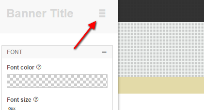
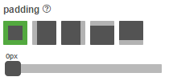

#Canvas designer
 
##What is the Canvas Designer?

The Canvas Designer is an *Umbraco* feature that allows real time styles edition.

It allows to accurately change, resize any CSS dimension by clicking the mouse, without any line of code. Any changes are immediately displayed in real-time and achieve best perfection for templating.
The Canvas Designer have a set of style editor to change colors, sizes, borders, fonts and else so on...

##Getting Started

###Enable the Canvas Designer

To active the Canvas Designer into a website, only one statement is required into the *head* tag of your main template of the site.

	@Umbraco.EnableCanvasDesigner()

It have to be place just after the stylesheet links.
	

###Use of the canvas designer

The Canvas Designer is located into the *Umbraco* preview mode and can be access through any page from the Website.

The Canvas Designer option appears just below the device preview buttons, in the right side panel control.

The first option of the Canvas Designer is the palette panel control. It consists on a set of pre-configured styles that can be apply directly to the website.
Any change is immediately displayed in real-time on the right side panel. 

The third option of the Canvas Designer allows the element by element style edition.

The second left panel show the element list that can be edited. 
These elements can be selected on the list or can be selected directly on the right side panel, in the preview page..

Once an element is selected, its styles can be modified through the different styles editors available.

To go back to the main element list, click on the burger menu at the top right corner of the second panel.

###Save page style

The custom styles are saved by clicking on *save styles*, this action compile and minify all these styles into a ready to use. css file.
The statement @Umbraco.EnableCanvasDesigner() mentioned before will add a stylesheet link to this file into the webpage.

###Create page styles

By default, custom styles are apply to the entire web site from its root node to its descendants children.
However, new custom styles can be create from a specific node of the website clicking on *Create page styles* into its preview mode
These styles will be apply from this node to all its descendants children.

###Reset Style

Custom style can be reset clicking on *Reset Style*, this action delete the respected css file.

##Configurations

###Canvas Designer Configurations

By default, the Canvas Designer comes with a simple configuration for the Umbraco Starter Kit styles edition. However, custom configuration can be easy done for any kind of mark-up and web design.

The Canvas designer configuration is a JSON file. Its location can be specify into the EnableCanvasDesigner statement's first parameter.

The configuration basically defines a set of style editors that can be apply for elements:

	var canvasdesignerConfig = {
    configs: [{
        name: "Body",
        schema: "body",
        selector: "body",
        editors: [
            {
                type: "background",
                category: "Color",
                name: "Background",
            },
			.
			.
			.
		]}
	}
	
Config has 4 parameters:

- name: (mandatory) friendly name of the element (Body / Header / Main Column ...).
- schema: (mandatory) element's selector(s) where custom style will be apply (body / h1 / p, a, span/ .main ...).
- selector: (optional) selector used for the highlight of the element (body / h1 / .header...), if empty *schema* is used instead.
- editors: (mandatory) list of style editors available for the element.

#### Editors

The Canvas Designer comes with 9 different available editors:

- background
- border
- color
- googlefontpicker
- margin
- padding
- radius
- shadow
- slider

The base parameters of these editor are:

	{
		type: "...",     // mandatory, alias of the editor (background, border...)
		category: "...", // mandatory, string that describe the category of the editor (color, position...)
		name: "..."      // mandatory, friendly name of the editor (Background, Background color ...)
		schema: "..."	 // optional, overwrite the schema parameter of the conig
		...
	}
	
Furthermore, some editors have others additional parameters.

##### Background editor

*Alias*: background

This editor is used for edit the color and the image background.
Images are picked up from the Umbraco Media library

This editor doesn't have additional parameters
 

 
##### Border editor

*Alias*: border

This editor is used for edit element borders.

*Parameters*:

	{
		...
		enable: ["top", "bottom"...] 	// optional, which edge can be editable: "all", "left", "right", "top", "bottom"
	}
	

##### Color editor

*Alias*: color

This editor is used for edit color (font, border, background...).

*Parameters*:

	{
		...
		css: "..."	// mandatory, css tag use to apply the color (color, border-color, background-color ...) 
	}

	
##### Googlefontpicker editor

*Alias*: googlefontpicker

This editor is used for edit web and googlefont family.

This editor doesn't have additional parameters

##### Margin editor

*Alias*: margin

This editor is used for edit element margins.

*Parameters*:

	{
		...
		enable: ["top", "bottom"...] 	// optional, which edge can be editable: "all", "left", "right", "top", "bottom"
	}
	

	
##### Padding editor

*Alias*: padding

This editor is used for edit element paddings.

*Parameters*:

	{
		...
		enable: ["top", "bottom"...] 	// optional, which edge can be editable: "all", "left", "right", "top", "bottom"
	}

	
##### Radius editor

*Alias*: radius

This editor is used for edit element border radius.

*Parameters*:

	{
		...
		enable: ["top", "bottom"...] 	// optional, which edge can be editable: "all", "left", "right", "top", "bottom"
	}
	

	
##### Shadow editor

*Alias*: shadow

This editor is used for edit element border radius.

This editor doesn't have additional parameter

##### Slide editor

*Alias*: slide

This editor is used for edit any kind of css size (margin, font size, padding, width, height...).

*Parameters*:

	{
		...
		css: "..."	// mandatory, css tag use to apply the size (margin, font-size, width ...) 
		min: 18,	// mandatory, min size in pixel 
		max: 100	// mandatory, max size in pixel 
	}

	
### Palette Configurations

Pre-configured palette setting can be modified into another JSON file, its path can be specified in the second parameters of the EnableCanvasDesigner statement.

A palette setting is mainly a set of value apply to the editors of the canvas. 

	var canvasdesignerPalette = [

		{
			name:"Palette 1", // Friendy name of the palette setting
			color1: "rgb(193, 202, 197)", 		// Palette Color 1, 
			color2: "rgb(231, 234, 232)", 		// Palette Color 2
			color3: "rgb(107, 119, 112)", 		// Palette Color 3
			color4: "rgb(227, 218, 168)", 		// Palette Color 4
			color5: "rgba(21, 28, 23, 0.95)",	// Palette Color 5
			// set of value that can be apply to the editors of the canvas
			data:
				{
					"widebodytypewidecategorydimensionnamelayout": "wide","imageorpatternbodytypebackgroundcategorycolornamebackground": "","colorbodytypebackgroundcategorycolornamebackground": "","colorbodytypecolorcategoryfontnamefontcolormaincsscolorschemabodyh1h2h3h4h5h6h7navlia": "rgb(107, 119, 112)","colorbodytypecolorcategoryfontnamefontcolorsecondarycsscolorschemaulmetabyline": "rgb(193, 202, 197)","fontfamilybodytypegooglefontpickercategoryfontnamefontfamilycsscolorschemabodyh1h2h3h4h5h6h7bylinenavbutton": "Open Sans Condensed","fonttypebodytypegooglefontpickercategoryfontnamefontfamilycsscolorschemabodyh1h2h3h4h5h6h7bylinenavbutton": "google","fontweightbodytypegooglefontpickercategoryfontnamefontfamilycsscolorschemabodyh1h2h3h4h5h6h7bylinenavbutton": "700","fontstylebodytypegooglefontpickercategoryfontnamefontfamilycsscolorschemabodyh1h2h3h4h5h6h7bylinenavbutton": "","imageorpatternnavtypebackgroundcategorycolornamebackground": "","colornavtypebackgroundcategorycolornamebackground": "","bordersizenavtypebordercategorycolornameborder": "","bordercolornavtypebordercategorycolornameborder": "","bordertypenavtypebordercategorycolornameborder": "solid","leftbordersizenavtypebordercategorycolornameborder": "","leftbordercolornavtypebordercategorycolornameborder": "","leftbordertypenavtypebordercategorycolornameborder": "solid","rightbordersizenavtypebordercategorycolornameborder": "","rightbordercolornavtypebordercategorycolornameborder": "","rightbordertypenavtypebordercategorycolornameborder": "solid","topbordersizenavtypebordercategorycolornameborder": "","topbordercolornavtypebordercategorycolornameborder": "","topbordertypenavtypebordercategorycolornameborder": "solid","bottombordersizenavtypebordercategorycolornameborder": "","bottombordercolornavtypebordercategorycolornameborder": "","bottombordertypenavtypebordercategorycolornameborder": "solid","colornavtypecolorcategorynavnamefontcolorcsscolorschemanavlia": "rgb(107, 119, 112)","colornavtypecolorcategorynavnamefontcolorhoverselectedcsscolorschemanavlihovera": "rgb(255, 255, 255)","colornavtypecolorcategorynavnamebackgroundcolorhovercssbackgroundcolorschemanavlihovera": "rgb(193, 202, 197)","colornavtypecolorcategorynavnamebackgroundcolorselectedcssbackgroundcolorschemanavlicurrentpageitema": "rgb(227, 218, 168)","fontfamilynavtypegooglefontpickercategoryfontnamefontfamilly": "","fonttypenavtypegooglefontpickercategoryfontnamefontfamilly": "","fontweightnavtypegooglefontpickercategoryfontnamefontfamilly": "","fontstylenavtypegooglefontpickercategoryfontnamefontfamilly": "","colorheaderlogodivtypecolorcategorycolornamebordercolorcssbordertopcolorschemaheaderlogo": "rgb(231, 234, 232)","paddingvalueheaderlogodivtypepaddingcategorypositionnamemarginenabletopbottomschemaheader": "","leftpaddingvalueheaderlogodivtypepaddingcategorypositionnamemarginenabletopbottomschemaheader": "","rightpaddingvalueheaderlogodivtypepaddingcategorypositionnamemarginenabletopbottomschemaheader": "","toppaddingvalueheaderlogodivtypepaddingcategorypositionnamemarginenabletopbottomschemaheader": "172","bottompaddingvalueheaderlogodivtypepaddingcategorypositionnamemarginenabletopbottomschemaheader": "101","colorh2typecolorcategorycolornamebordercolorcssbordertopcolorschemah2major": "rgb(231, 234, 232)","colorh2typecolorcategoryfontnamefontcolorcsscolor": "","colorh3typecolorcategoryfontnamefontcolorcsscolor": "","colorbannerh2typecolorcategoryfontnamefontcolorcsscolor": "","sliderbannerh2typeslidercategoryfontnamefontsizecssfontsizemin18max100": "45","marginvaluebannerh2typemargincategorypositionnamemargin": "","leftmarginvaluebannerh2typemargincategorypositionnamemargin": "","rightmarginvaluebannerh2typemargincategorypositionnamemargin": "","topmarginvaluebannerh2typemargincategorypositionnamemargin": "","bottommarginvaluebannerh2typemargincategorypositionnamemargin": "","colorbannerbylinetypecolorcategoryfontnamefontcolorcsscolor": "","sliderbannerbylinetypeslidercategoryfontnamefontsizecssfontsizemin18max100": "22","marginvaluebannerbylinetypemargincategorypositionnamemargin": "","leftmarginvaluebannerbylinetypemargincategorypositionnamemargin": "","rightmarginvaluebannerbylinetypemargincategorypositionnamemargin": "","topmarginvaluebannerbylinetypemargincategorypositionnamemargin": "","bottommarginvaluebannerbylinetypemargincategorypositionnamemargin": "","imageorpatternbannertypebackgroundcategorycolornamebackgroundcsscolor": "","colorbannertypebackgroundcategorycolornamebackgroundcsscolor": "rgba(21, 28, 23, 0.95)","imageorpatternbannerwrappertypebackgroundcategorycolornamebackground": "","colorbannerwrappertypebackgroundcategorycolornamebackground": "","paddingvaluebannerwrappertypepaddingcategorypositionnamepaddingenabletopbottom": "","leftpaddingvaluebannerwrappertypepaddingcategorypositionnamepaddingenabletopbottom": "","rightpaddingvaluebannerwrappertypepaddingcategorypositionnamepaddingenabletopbottom": "","toppaddingvaluebannerwrappertypepaddingcategorypositionnamepaddingenabletopbottom": "123","bottompaddingvaluebannerwrappertypepaddingcategorypositionnamepaddingenabletopbottom": "125","bordersizemainwrappertypebordercategorystylingnameborderenabletopbottom": "","bordercolormainwrappertypebordercategorystylingnameborderenabletopbottom": "","bordertypemainwrappertypebordercategorystylingnameborderenabletopbottom": "solid","leftbordersizemainwrappertypebordercategorystylingnameborderenabletopbottom": "","leftbordercolormainwrappertypebordercategorystylingnameborderenabletopbottom": "","leftbordertypemainwrappertypebordercategorystylingnameborderenabletopbottom": "solid","rightbordersizemainwrappertypebordercategorystylingnameborderenabletopbottom": "","rightbordercolormainwrappertypebordercategorystylingnameborderenabletopbottom": "","rightbordertypemainwrappertypebordercategorystylingnameborderenabletopbottom": "solid","topbordersizemainwrappertypebordercategorystylingnameborderenabletopbottom": "32","topbordercolormainwrappertypebordercategorystylingnameborderenabletopbottom": "rgb(227, 218, 168)","topbordertypemainwrappertypebordercategorystylingnameborderenabletopbottom": "solid","bottombordersizemainwrappertypebordercategorystylingnameborderenabletopbottom": "10","bottombordercolormainwrappertypebordercategorystylingnameborderenabletopbottom": "rgb(193, 202, 197)","bottombordertypemainwrappertypebordercategorystylingnameborderenabletopbottom": "solid","radiusvalueimageimageimgimagebeforetyperadiuscategorystylingnameradius": "8","topleftradiusvalueimageimageimgimagebeforetyperadiuscategorystylingnameradius": "","toprightradiusvalueimageimageimgimagebeforetyperadiuscategorystylingnameradius": "","bottomleftradiusvalueimageimageimgimagebeforetyperadiuscategorystylingnameradius": "","bottomrightradiusvalueimageimageimgimagebeforetyperadiuscategorystylingnameradius": "","colorbuttontypecolorcategorycolornamecolorcsscolor": "rgb(255, 255, 255)","colorbuttontypecolorcategorycolornamebackgroundcssbackground": "rgb(227, 218, 168)","colorbuttontypecolorcategorycolornamebackgroundhovercssbackgroundschemabuttonhover": "rgb(235, 227, 178)","radiusvaluebuttontyperadiuscategorystylingnameradius": "7","topleftradiusvaluebuttontyperadiuscategorystylingnameradius": "","toprightradiusvaluebuttontyperadiuscategorystylingnameradius": "","bottomleftradiusvaluebuttontyperadiuscategorystylingnameradius": "","bottomrightradiusvaluebuttontyperadiuscategorystylingnameradius": "","colorbuttonalttypecolorcategorycolornamecolorcsscolor": "rgb(255, 255, 255)","colorbuttonalttypecolorcategorycolornamebackgroundcssbackground": "rgb(193, 202, 197)","colorbuttonalttypecolorcategorycolornamebackgroundhovercssbackgroundschemabuttonalthover": "rgb(204, 213, 208)"
				}
		},

		{
		....
		}
	]
	
The palette colors values are used only to give an orientated color idea to the user. 
Data is the set of value that will be apply to the editor. 

The most easy way to create a new palette, is to first customize you style through the canvas designer and then click on the save option "Make preset".
This action will open a text box with all the value needed for the palette. These value can be copied and past into the Palette config file.

